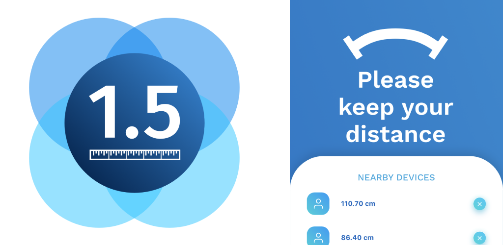

# 1point5

## The app that helps you with social distancing.



www.onepointfive.app

> 1.5 assists you with social distancing. The app scans for nearby mobile devices and it warns you when a device enters your 1.5 meter parameter. The phone vibrates and send you a notification.
> It is a friendly reminder that aims to defuse the situation.
>This is a social distancing app and it works using Bluetooth. Devices of family members and so forth can be excluded. 1.5 aims to help create social distance awareness.
>Please follow the advice of the World Health Organisation and your local government.

[](https://apple.co/35jhajs) [](https://play.google.com/store/apps/details?id=app.onepointfive)

## Getting Started
 
 The app won't work when running on the browser or simulators, only on a real device that has access to bluetooth.
 
 First make sure you have JAVA, Android Studio/Xcode installed.
 Check for more info: https://cordova.apache.org/docs/en/latest/guide/cli/
 
Installing dependencies
```
npm i
```
 
Building the APP.
This command will trigger VUE Cli and will build the app inside the `www` folder. 
```
npm run build
 ```

Once the build is finished run:
Remember that the only way to test it is by connecting your iPhone or Android via USB.
```
npm run andoid

//or

npm run ios
 ```
